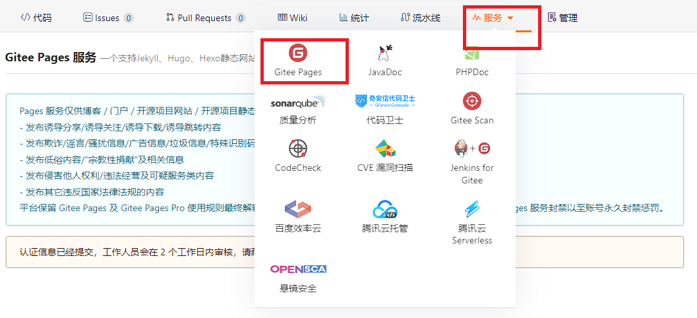

### gitee 搭建
1. 这个参考我的<git 学习与汇总>
2. 登录gitee，需要开启page服务(gitee pages)，需要上传身份信息,如下图
	

### hexo+gitee 博客搭建
1. 先通过官网教程处理一波 `hexo` 在 `linux` 的安装. [官网教程](https://hexo.io/zh-cn/docs/)
	具体指令大致如下:
	```
	sudo apt-get install git-core
	curl -fsSL https://deb.nodesource.com/setup_20.x | sudo -E bash - &&\
	sudo apt-get install -y nodejs
	// 安装完之后, 就可以用 npm 指令了
	npm install -g hexo-cli
	// Linux 用户可以将 Hexo 所在的目录下的 node_modules 添加到环境变量之中即可直接使用 hexo <command>
	echo 'PATH="$PATH:./node_modules/.bin"' >> ~/.profile
	```
2. 安装 Hexo 完成后，请执行下列命令，Hexo 将会在指定文件夹中新建所需要的文件。
	```
	hexo init MyBlog
	cd Myblog
	npm install
	```
	新建完成之后, MyBlog 文件夹目录如下
	```
	.
	├── _config.yml
	├── package.json
	├── scaffolds
	├── source
	|   ├── _drafts
	|   └── _posts
	└── themes
	```
3. 之后转战下一个教程, [gitee+hexo](https://blog.csdn.net/cider_m/article/details/122820175)
	```
	hexo g // 生成
	hexo s // 是开启本地预览服务，打开浏览器访问 http://localhost:4000 即可看到容内
	```
4. 换主题
	* [3-hexo 使用说明网站](https://yelog.org/2017/03/23/3-hexo-instruction/)
	* `cd WorkProject/Myblog`
	* `git clone https://github.com/yelog/hexo-theme-3-hexo.git themes/3-hexo`
	* 修改`_config.yml`中的`theme: landscape`改为`theme: 3-hexo`，然后重新执行`hexo g`来重新生成。
		如果出现一些莫名其妙的问题，可以先执行`hexo clean`来清理一下`public`的内容，然后再来重新生成和发布。
	* 显示图片插件安装 `npm install hexo-asset-img --save`
	```
	language: zh-CN #
	highlight:
		enable: false
	```
	
5. 上传 `gitee` 配置(**所有冒号后面都有空格**)
	* 安装插件: `npm install hexo-deployer-git --save`
	* 配置`_config.yml`中有关`deploy`的部分：
		```
		deploy:
		  type: git
		  repository: git@gitee.com:forambious/my-blog.git
		  branch: master
		```
	* `hexo d` 提交代码
6. 常用命令
	```
	hexo new "postName" 	 	#新建文章
	hexo new page "pageName"	#新建页面
	hexo generate 			#生成静态页面至public目录
	hexo server 			#开启预览访问端口（默认端口4000，'ctrl + c'关闭server）
	hexo deploy 			#部署到GitHub
	hexo help  			# 查看帮助
	hexo version  			#查看Hexo的版本
	
	// 知道下面这几个指令就好
	hexo new "postName" 	 	#新建文章
	hexo clean			#有问题先 clean 试试
	hexo g				#生成静态网页
	hexo s				#本地预览
	hexo d				#推到gitee
	```

